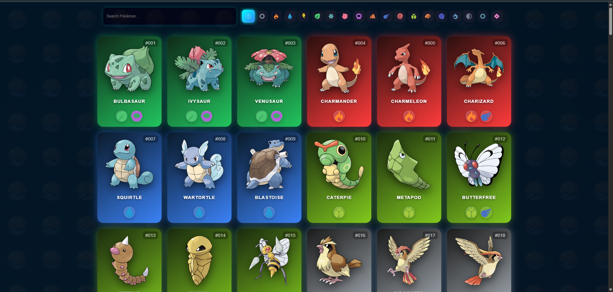
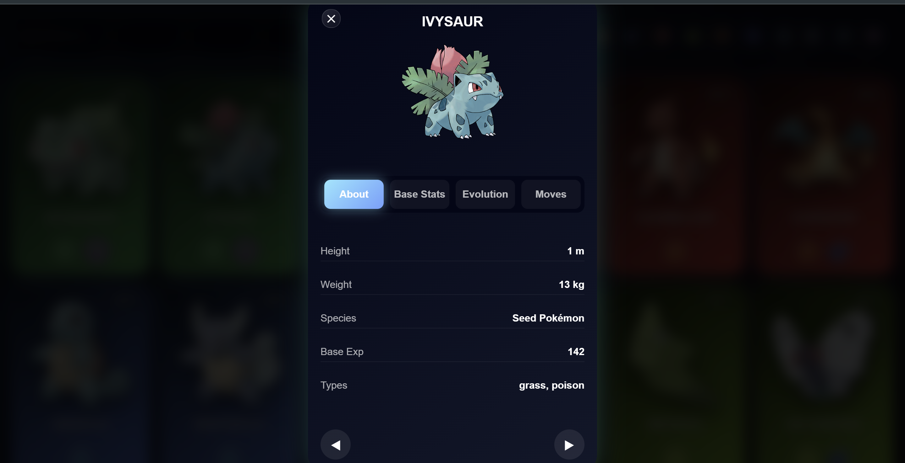

# 🎮 Pokédex

Responsive Pokédex web application built with HTML, CSS and JavaScript.  
Developed as part of the **Developer Akademie** training program.

---

## 🚀 Tech Stack


---

## 📌 Overview

Pokédex is a fully responsive Pokémon web application using the official PokéAPI.

The project focuses on:

- Dynamic Pokémon rendering
- Interactive overlay system
- API integration with async JavaScript
- Responsive UI design
- Modular JavaScript architecture
- Search and filter functionality
- Clean code structure and scalability

---

## 🎯 Features

- Dynamic Pokémon cards
- Real-time search with partial name matching
- Pokémon type filters
- Detailed overlay view
- Base stats display
- Evolution chain rendering
- Move list
- Previous / next Pokémon navigation
- Responsive overlay for mobile devices
- Optimized loading behavior
- Clean modular structure

---

## 🖥 Preview

Example:



---

## ⚙️ Installation

```bash
git clone https://github.com/ChriosNo86/pokedex.git
cd pokedex
open index.html
```

---

## 🎓 Project Context

This project was developed during the Developer Akademie training program  
to practice API integration, responsive frontend development and modular JavaScript architecture.

---

## 👨‍💻 Author

Christian Noack  
https://christian-noack.com

Software Architecture · Engineering
